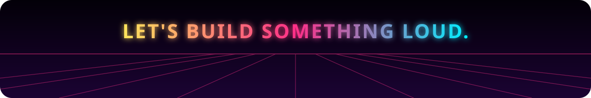

  
 
   
   
  
   
  
 
   
 
  also shipped&nbsp;&nbsp;→&nbsp;&nbsp; <a href="https://github.com/Sicariusa/carpooling-backend">kafka carpooling</a>&nbsp;·&nbsp; <a href="https://github.com/Sicariusa/Flights">live flight radar</a>&nbsp;·&nbsp; <a href="https://earth-threejs-eta.vercel.app">3d earth</a>&nbsp;·&nbsp; <a href="https://www.statements-corp.com">statements corp</a>  
   
  
   
  

