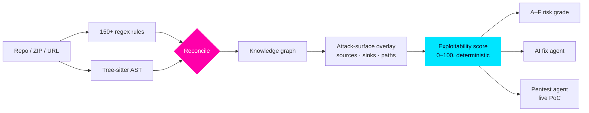

<a href="https://abdullahsayed.vercel.app">
  
</a>

<p align="center">
  
</p>

<p align="center">
  <a href="https://abdullahsayed.vercel.app"></a>
  <a href="https://www.linkedin.com/in/abdullah-mohamed-56a853254/"></a>
  
</p>

<br/>

```ts
const abdullah = {
  role:        "Software Engineer — Security Tooling & Full-Stack",
  experience:  ["QA & Testing Engineer — production fintech app @ Geidea",
                "Frontend / UI lead — Statements Corp (live financial-services site)"],
  building:    "SecureVibe — a static-analysis engine that grades exploitability",
  shipped:     { commitsToSecureVibe: 531, since: "May 2026", packages: 10 },
  thinksIn:    ["ASTs", "taint flow", "event streams", "permission bitfields"],
  rule:        "emit a finding only when you can prove it",
};
```


## ⚡ Flagship — SecureVibe

> **A security scanner that argues with itself.** Regex rules cast a wide net, Tree-sitter ASTs cross-examine every hit,
> a code graph traces whether an attacker can actually reach it — and only proven findings get to be *critical*.

<table>
<tr>
<td width="50%" valign="top">

| Signal | Number |
|:--|--:|
| Security rules (regex + AST) | **150+** |
| Vulnerability categories | **16** |
| Scan throughput | **1.6M LOC / 10,690 files in 121 s** |
| DVNA documented-vuln recall | **81.3 %** (13 / 16) |
| False positives on `zod` (48 KLOC) | **0** |
| Hard FPs on a real AI app | **12 → 0** |
| Engine validation tests | **297** |
| TypeScript in the monorepo | **~140K lines** |

</td>
<td width="50%" valign="top">

**What's inside**

- 🌳 **Tree-sitter + ts-morph** AST engine reconciling regex hits with structural evidence
- 🕸️ **Knowledge + attack-surface graph** — routes, calls, DB, taint sources → sinks
- 🎯 **Deterministic exploitability** — `confirmed / reachable / unknown / dead_code`, 0–100 confidence, **no LLM**
- 🧭 **Multi-source BFS** from public routes to prove reachability
- 🩹 **Fix-with-AI** — review-first, exact-match patch agent
- 🗡️ **Pentest agent** — tool-using LLM that proves findings against a live target
- 📊 Benchmarked head-to-head vs **Semgrep, CodeQL, Snyk, SonarQube** on the OpenSSF CVE Benchmark (200+ real CVEs) and RealVuln (66 repos)

</td>
</tr>
</table>



<p align="center">
  
  
  
  
  
  
</p>


## 🛰️ Latest Builds

<table>
<tr>
<td width="50%" valign="top">

### 📱 [Mobile QA Runner](https://github.com/Sicariusa/mobile-testing)
`Python` · `uiautomator2` · `Tesseract OCR` · `ADB`

Hand it an **APK + a YAML test case** — it installs, launches, taps, types, swipes and **validates every step two ways**: the accessibility tree *and* screenshot OCR for text the tree never exposes.

- 🔁 **Recovery ladder** — wait/retry → dismiss keyboard → scroll into view → OCR, before it gives up
- 🧾 Every step leaves evidence: before/after shots, hierarchy dump, recovery trace
- 📄 Self-contained **HTML report** per run
- 🩺 `--check-env` diagnoses the whole toolchain and **never throws**

<sub>Born from real fintech QA work — 63 commits, 25 test modules.</sub>

</td>
<td width="50%" valign="top">

### 🎧 [Discord Clone](https://github.com/Sicariusa/discord-clone)
`NestJS` · `React` · `PostgreSQL` · `Redis` · `LiveKit`

Not a UI copy — a **faithful rebuild of Discord's hard parts**: realtime chat, voice/video, and the permission model.

- 🔐 Permissions as a **`bigint` bitfield**, resolved in Discord's exact overwrite order — one engine **shared by client and server** so they can't disagree
- 🛰️ Raw **WebSocket gateway** with opcode/dispatch + **Redis pub/sub** fan-out for horizontal scale
- 🎙️ **LiveKit SFU** — the API mints tokens whose publish grants come from your role perms
- 🤖 First-class **bots** governed by the same permission engine

</td>
</tr>
</table>

## 🧩 More From The Lab

| | Project | The interesting part | Stack |
|:-:|:--|:--|:--|
| 🚗 | [**Carpooling System**](https://github.com/Sicariusa/carpooling-backend) | User · Booking · Ride microservices talking over **Kafka** topics, containerized end-to-end | NestJS · Kafka · MongoDB · Docker |
| ✈️ | [**SkyTracker**](https://github.com/Sicariusa/Flights) | Thousands of **live aircraft** on a 3D map — click any plane for ICAO details | React · Mapbox GL · OpenSky |
| 🌍 | [**Earth Visualization**](https://earth-threejs-eta.vercel.app) | Fresnel atmosphere shader, animated clouds, procedural starfield — **zero build step** | Three.js · WebGL |
| 🤖 | [**AI App Builder**](https://github.com/Sicariusa/chef) | Fork of Convex Chef with prompt-engineered codegen and **error auto-correction** | Gemini · Convex · Docker |
| 💼 | [**Statements Corp**](https://www.statements-corp.com) | **In production.** Contentful CMS, Mapbox service regions, SEO pipeline | React · Contentful · Framer Motion |
| 📚 | [**E-Learning Platform**](https://github.com/Sicariusa/E-Learning-Platform) | Full MERN platform deployed on Railway | MongoDB · Express · React · Node |


## 🛠️ Arsenal

<p align="center">
  <b><sub>LANGUAGES</sub></b><br/>
  
  <br/><br/>
  <b><sub>BACKEND · DATA · INFRA</sub></b><br/>
  
  <br/><br/>
  <b><sub>FRONTEND · MOBILE · 3D</sub></b><br/>
  
  <br/><br/>
  <b><sub>AI · TESTING · TOOLING</sub></b><br/>
  
</p>

## 📡 Signal

<p align="center">
  
  
</p>

<p align="center">
  
</p>


